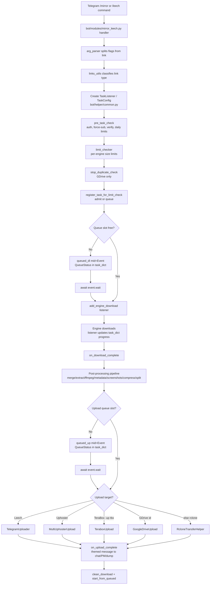

# NEO-WZML — Project Skill

End-to-end development guide for the NEO-WZML Telegram mirror/leech bot (v1.1.3, Python 3.11+, AGPL-3.0). Based on WZML-X by irisXDR.

## 1. What This Project Is

NEO-WZML is a single async Python process (uvloop event loop) that runs a Pyrogram (PyroBlack) Telegram bot, a FastAPI web server, and several download/upload engines. It downloads from many sources and uploads to many destinations, with FFmpeg media processing, archive handling, queues, per-user limits, and MongoDB persistence.

- **Runtime:** Python 3.11+, uvloop, asyncio
- **Bot framework:** PyroBlack (Pyrogram fork)
- **Web:** FastAPI + Uvicorn/Gunicorn, Jinja2 templates
- **DB:** MongoDB via Motor (async)
- **Torrents:** Aria2 (aioaria2) + qBittorrent (aioqbt / qbittorrent-api)
- **Cloud:** rclone, google-api-python-client, MegaSDK, TeraBoxSDK
- **Media:** FFmpeg, yt-dlp, Pillow, python-magic
- **Deploy:** Docker + docker-compose (port 880 web, 8880 rclone serve)

## 2. Repository Layout (end-to-end map)

```
NEO-WZML/
├── bot/
│   ├── __init__.py            # Event loop, LOGGER, global state dicts, DOWNLOAD_DIR
│   ├── __main__.py            # Entry point: Config.load(), startup sequence, handler registration
│   ├── version.py             # get_version() -> "v1.1.3"
│   ├── core/
│   │   ├── config_manager.py  # Config + BinConfig classes (all settings as class attrs)
│   │   ├── handlers.py        # add_handlers() — wires Pyrogram Message/Callback handlers
│   │   ├── jdownloader_booter.py
│   │   ├── plugin_manager.py  # PluginManager, PluginBase, PluginInfo dataclass
│   │   ├── startup.py         # load_settings, update_qb/aria2_options, load_configurations
│   │   ├── tg_client.py       # TgClient: bot, user, helper bots startup
│   │   └── torrent_manager.py # TorrentManager: aria2 + qbittorrent init
│   ├── helper/
│   │   ├── common.py
│   │   ├── thumbnail_utils.py
│   │   ├── ext_utils/         # Cross-cutting utilities
│   │   │   ├── bot_utils.py        # arg_parser, new_task, sync_to_async, COMMAND_USAGE
│   │   │   ├── bulk_links.py
│   │   │   ├── db_handler.py       # database (Motor) — settings, users, tasks, rss
│   │   │   ├── error_handler.py
│   │   │   ├── exceptions.py       # DirectDownloadLinkException, etc.
│   │   │   ├── filename_utils.py
│   │   │   ├── files_utils.py      # clean_all, archive ops, split
│   │   │   ├── help_messages.py    # get_bot_commands, get_help_string
│   │   │   ├── hyperdl_utils.py
│   │   │   ├── links_utils.py      # is_magnet, is_gdrive_link, is_terabox_link, etc.
│   │   │   ├── media_utils.py      # screenshots, sample video, thumbnails
│   │   │   ├── merge_utils.py
│   │   │   ├── metadata_utils.py
│   │   │   ├── shortener_utils.py
│   │   │   ├── status_utils.py
│   │   │   ├── task_manager.py     # pre_task_check, register_task_for_limit_check, queues
│   │   │   └── telegraph_helper.py
│   │   ├── languages/         # bn.py, en.py — i18n strings
│   │   ├── listeners/         # Per-engine progress listeners (update task_dict)
│   │   │   ├── aria2_listener.py
│   │   │   ├── direct_listener.py
│   │   │   ├── jdownloader_listener.py
│   │   │   ├── mega_listener.py
│   │   │   ├── qbit_listener.py
│   │   │   ├── task_listener.py    # TaskListener base class
│   │   │   └── terabox_listener.py
│   │   ├── mirror_leech_utils/
│   │   │   ├── qbit_compat.py
│   │   │   ├── download_utils/     # One module per download engine
│   │   │   │   ├── aria2_download.py
│   │   │   │   ├── direct_downloader.py
│   │   │   │   ├── direct_link_generator.py  # Site-specific scrapers
│   │   │   │   ├── gd_download.py
│   │   │   │   ├── jd_download.py
│   │   │   │   ├── mega_download.py
│   │   │   │   ├── qbit_download.py
│   │   │   │   ├── rclone_download.py
│   │   │   │   ├── telegram_download.py
│   │   │   │   ├── terabox_download.py
│   │   │   │   └── yt_dlp_download.py
│   │   │   ├── upload_utils/
│   │   │   │   ├── telegram_uploader.py
│   │   │   │   └── terabox_upload.py
│   │   │   ├── uphoster_utils/      # DDL hosts
│   │   │   │   ├── buzzheavier_utils/
│   │   │   │   ├── gofile_utils/
│   │   │   │   ├── pixeldrain_utils/
│   │   │   │   └── multi_upload.py
│   │   │   ├── gdrive_utils/        # clean, clone, count, delete, download, list, search, upload
│   │   │   ├── rclone_utils/        # list, serve, transfer
│   │   │   ├── terabox_utils/       # list.py (account browsing)
│   │   │   └── status_utils/        # One status class per engine (MirrorStatus subclasses)
│   │   └── telegram_helper/
│   │       ├── bot_commands.py      # BotCommands — command name registry
│   │       ├── button_build.py
│   │       ├── filters.py           # CustomFilters: authorized, sudo, owner, etc.
│   │       ├── message_utils.py     # auto_delete_message, delete_links, send
│   │       └── tg_utils.py
│   ├── modules/               # Telegram command handlers (one file per command group)
│   │   ├── mirror_leech.py    # /mirror /leech /qb /qbleech /jd /jdleech /ytdl /ytdlleech
│   │   ├── clone.py
│   │   ├── status.py
│   │   ├── stats.py
│   │   ├── search.py
│   │   ├── rss.py
│   │   ├── bot_settings.py    # /bsetting — owner panel
│   │   ├── users_settings.py  # /usettings
│   │   ├── file_selector.py   # Web file selection (-s)
│   │   ├── dump_select.py
│   │   ├── cancel_task.py
│   │   ├── force_start.py
│   │   ├── chat_permission.py
│   │   ├── exec.py / shell.py
│   │   ├── help.py
│   │   ├── mediainfo.py / metadata.py
│   │   ├── restart.py
│   │   ├── save_msg.py
│   │   ├── services.py
│   │   ├── speedtest.py
│   │   ├── uphoster.py
│   │   ├── gd_search.py / gd_count.py / gd_clean.py / gd_delete.py
│   │   └── plugin_manager.py
│   └── themes/                # Bot UI themes (default: neo_minimal)
├── plugins/                  # External plugin drop-in folder (PluginBase subclasses)
│   └── speedtest_plugin.py
├── myjd/                     # JDownloader API client (myjdapi)
├── web/
│   ├── wserver.py            # FastAPI app, routes for file selectors + qbit proxy
│   ├── nodes.py
│   ├── mega_selection_store.py
│   ├── rclone_selection_store.py
│   ├── terabox_selection_store.py
│   └── templates/            # landing.html, page.html (Jinja2)
├── qBittorrent/config/qBittorrent.conf
├── gen_scripts/              # CLI helpers (drive tokens, pyro sessions, SA accounts)
├── cron_boot.py              # Keep-alive pinger for cloud hosts
├── update.py                 # Git pull + pip upgrade on boot
├── start.sh                  # venv activate -> update.py -> python -m bot
├── Dockerfile                # FROM irisxdr/neo-wzml:latest
├── docker-compose.yml        # app service, ports 880 + 8880, optional Gluetun VPN
├── requirements.txt
├── sample_config.py          # Template -> copy to config.py (git-ignored)
└── README.md
```

## 3. Startup Sequence (end-to-end)

`python -m bot` runs `bot/__main__.py`:

1. `Config.load()` — reads `config.py` (or env overrides for the allow-list).
2. `load_settings()` — pulls persisted settings from MongoDB (`thumbnails`, `tokens`, `rclone`).
3. `TgClient.start_bot()` / `start_user()` / `start_helper_bots()` — Pyrogram clients.
4. `load_configurations()` + `update_variables()` — drives, auth chats, sudo users, RSS dict.
5. `TorrentManager.initiate()` — connects Aria2 and qBittorrent.
6. `update_qb_options()` + `update_aria2_options()` — sync preferences (qBittorrent 5.2+ password rules enforced via `_ensure_qbit_web_password`).
7. `jdownloader.boot()`, `clean_all()`, `initiate_search_tools()`, `telegraph.create_account()`, `rclone_serve_booter()`.
8. `get_plugin_manager()` + `register_plugin_commands()` — loads `plugins/*.py`.
9. `BotCommands._build_command_vars()` — finalizes command names from config.
10. `add_handlers()` + `add_aria2_callbacks()` — wires all Pyrogram handlers.

## 3.1 End-to-end request lifecycle (Mermaid)



## 3.2 Data & control flow summary

- **Control plane:** Telegram message → `bot/modules/*` handler → `TaskListener` → engine `add_*` → engine listener callbacks → `task_dict` updates → `/status` rendering.
- **Data plane:** link → engine downloads to `DOWNLOAD_DIR{mid}/` → post-processing mutates files in place (or `…10000/` symlink when seeding) → uploader reads from `up_dir` → uploads to target → `clean_download` removes `DOWNLOAD_DIR{mid}/`.
- **Persistence plane:** MongoDB (`db_handler.database`) stores `settings`, `users`, `tasks` (incomplete-task notifier), `rss`, `thumbnails`, `tokens`, `rclone`. Loaded at startup (`load_settings`), written on user setting changes and task start/complete.
- **Web plane:** FastAPI (`web/wserver.py`, port 880) serves file-selection pages that write choices into `*_selection_store.py` dicts; the engine listener reads those dicts when the user submits the web form. qBittorrent web UI is proxied on the same port.

## 4. Configuration

- **Source of truth:** `sample_config.py` → copy to `config.py` (git-ignored).
- **Runtime class:** `bot/core/config_manager.py` → `Config` (class attributes) + `BinConfig` (binary-stored settings).
- **Env override allow-list** (see `update.py`): `BOT_TOKEN`, `TELEGRAM_API`, `TELEGRAM_HASH`, `OWNER_ID`, `DATABASE_URL`, `BASE_URL`, `UPSTREAM_REPO`, `UPSTREAM_BRANCH`, `AUTO_UPDATE`, `UPDATE_PKGS`.
- **Required:** `BOT_TOKEN`, `OWNER_ID`, `TELEGRAM_API`, `TELEGRAM_HASH`, `DATABASE_URL`.
- **Recommended:** `BASE_URL` (web selectors), `RCLONE_PATH` or `GDRIVE_ID`, `LEECH_DUMP_CHAT`, `MEGA_EMAIL`/`MEGA_PASSWORD`, `TERABOX_ENABLED`, `DEFAULT_UPLOAD` (`rc`|`gd`|`tbx`).
- **Limiters (0 = unlimited):** `BOT_MAX_TASKS`, `USER_MAX_TASKS`, `*_LIMIT` (per engine), `QUEUE_ALL`/`QUEUE_DOWNLOAD`/`QUEUE_UPLOAD`.
- **Feature toggles:** `DISABLE_TORRENTS`, `DISABLE_LEECH`, `DISABLE_BULK`, `DISABLE_MULTI`, `DISABLE_SEED`, `DISABLE_FF_MODE`.
- **Secrets to keep out of git:** tokens, OAuth pickles, MongoDB URLs, rclone configs, Mega creds, TeraBox cookies, SA JSONs.

## 5. Download / Upload Engine Architecture

### Adding a new download engine

1. Create `bot/helper/mirror_leech_utils/download_utils/<engine>_download.py` exposing an `add_<engine>_download(listener, ...)` async function.
2. Add a link detector in `bot/helper/ext_utils/links_utils.py` (`is_<engine>_link`).
3. Add a status class in `bot/helper/mirror_leech_utils/status_utils/<engine>_status.py` subclassing the base `MirrorStatus`.
4. Add a listener in `bot/helper/listeners/<engine>_listener.py` updating `task_dict` + progress.
5. Wire dispatch in `bot/modules/mirror_leech.py` (route the link to your `add_*` function).
6. Register any new config keys in `bot/core/config_manager.py` `Config` and `sample_config.py`.

### Adding a new upload target

1. Create `bot/helper/mirror_leech_utils/upload_utils/<target>_uploader.py` (or under `uphoster_utils/` for DDL hosts).
2. Add a status class in `status_utils/<target>_status.py`.
3. Wire into the upload dispatch (see `DEFAULT_UPLOAD` cycling: `rc` → `gd` → `tbx`).
4. For DDL hosts, add a subfolder under `uphoster_utils/` and integrate via `multi_upload.py`.

### Upload targets supported

| Target | Flag / Config |
|--------|--------------|
| Telegram (leech) | default leech path, `LEECH_DUMP_CHAT`, `-ud` dumps |
| Google Drive | `GDRIVE_ID`, SA JSONs, Team Drives, `USER_TD_MODE` |
| TeraBox | `-up tbx`, `terabox.txt` cookie, `TERABOX_UPLOAD_PATH` |
| rclone | `RCLONE_PATH`, user configs via `mrcc:` |
| DDL | GoFile, BuzzHeavier, PixelDrain (`GOFILE_API`, `BUZZHEAVIER_API`, `PIXELDRAIN_KEY`) |

### Download engine reference (entry points)

Each engine module exposes an `add_*` async function that takes a `listener` (TaskListener) and starts the download, registering a status object in `task_dict`.

| Engine | Module | Entry function | Listener | Status class |
|--------|--------|----------------|----------|--------------|
| Aria2 (direct/magnet/torrent) | `aria2_download.py` | `add_aria2_download(listener, dpath, header, ratio, seed_time)` | `aria2_listener.py` | `Aria2Status` |
| qBittorrent | `qbit_download.py` | `add_qb_torrent(listener, path, ratio, seed_time)` | `qbit_listener.py` | `QbitStatus` |
| Direct HTTP | `direct_downloader.py` | `add_direct_download(listener, path)` | `direct_listener.py` | `DirectStatus` |
| Direct link generator | `direct_link_generator.py` | `direct_link_generator(link)` → returns direct URL (site-specific scrapers) | — | — |
| Google Drive | `gd_download.py` | `add_gd_download(listener, path)` | (gd listener) | `GdriveStatus` |
| Mega | `mega_download.py` | `add_mega_download(listener, path)` | `mega_listener.py` | `MegaStatus` |
| TeraBox (share link) | `terabox_download.py` | `add_terabox_download(listener, path)` | `terabox_listener.py` | `TeraboxStatus` |
| TeraBox (account file) | `terabox_download.py` | `add_terabox_account_download(listener, path)` | `terabox_listener.py` | `TeraboxStatus` |
| rclone (remote → local) | `rclone_download.py` | `add_rclone_download(listener, path)` / `add_rclone_web_selection(listener, path)` | (rclone) | `RcloneStatus` |
| Telegram message | `telegram_download.py` | `TelegramDownloadHelper` | (telegram) | `TelegramStatus` |
| yt-dlp | `yt_dlp_download.py` | `add_ytdl_download(listener, path)` | (ytdlp) | `YtDlpStatus` |
| JDownloader | `jd_download.py` | `add_jd_download(listener, path)` | `jdownloader_listener.py` | `JDownloaderStatus` |

### Command → engine dispatch (`bot/modules/mirror_leech.py`)

| Command | Default engine | Override |
|---------|----------------|----------|
| `/mirror` | Aria2 (direct/magnet/torrent), else engine by link type | `-qb` → qBittorrent, `-jd` → JDownloader |
| `/leech` | same as `/mirror` but `is_leech=True` | same |
| `/qb` / `/qbleech` | qBittorrent | — |
| `/jd` / `/jdleech` | JDownloader | — |
| `/ytdl` / `/ytdlleech` | yt-dlp | — |
| `/clone` | GDrive/rclone clone (no download) | `bot/modules/clone.py` |

Link-type routing inside `mirror_leech.py`: `is_magnet`/`.torrent` → Aria2 or qBittorrent; `is_mega_link` → Mega; `is_terabox_link` → TeraBox; `is_gdrive_link`/`is_gdrive_id` → GDrive; `is_rclone_path` → rclone; `is_telegram_link` → Telegram download; else `is_url` → direct (optionally through `direct_link_generator` for supported hosts).

## 6. Command & Argument System

- Commands live in `bot/modules/*.py` and are registered via `BotCommands` (`bot/helper/telegram_helper/bot_commands.py`).
- Filters in `bot/helper/telegram_helper/filters.py` (`CustomFilters.authorized`, `sudo`, `owner`).
- Argument parsing: `arg_parser` in `bot/helper/ext_utils/bot_utils.py`.
- Common args: `-n` rename, `-s` select, `-z`/`-e` zip/extract, `-zim` image-only zip, `-mv` merge, `-up <dest>`, `-up tbx`, `-i <N>` multi, `-ud <dumps>`, `-ff` ffmpeg, `-ss`/`-sv` screenshots/sample.
- Add-on commands (ultra branch): `/autorename` (`arn`), `/link` (`stream`, `f2l`), `/tokengen` (`tg`).
- Live command list: send `/help` in Telegram.

## 7. Plugin System

- Drop-in folder: `plugins/*.py` (git-tracked examples like `speedtest_plugin.py`).
- Base class: `PluginBase` in `bot/core/plugin_manager.py` with lifecycle hooks `on_load`/`on_unload`/`on_enable`/`on_disable`.
- `PluginInfo` dataclass: `name`, `version`, `author`, `description`, `enabled`, `handlers`, `commands`, `dependencies`.
- `PluginManager.discover_plugins()` globs `plugins/*.py`; `register_plugin_commands()` (in `bot/modules/plugin_manager.py`) wires commands.
- `BotCommands.refresh_commands()` + reload of `help_messages` keeps `/help` in sync after plugin changes.
- Use `register_command(command, handler_func, filters)` and `register_callback(pattern, callback_func, filters)` helpers.

## 8. Web UI & File Selection

- FastAPI app: `web/wserver.py` on port `880`.
- Routes serve: torrent file selection, Mega folder selection, rclone folder selection, TeraBox account browsing, and a qBittorrent web proxy.
- Selection stores: `web/mega_selection_store.py`, `web/rclone_selection_store.py`, `web/terabox_selection_store.py`.
- Templates: `web/templates/landing.html`, `page.html` (Jinja2).
- `BASE_URL` must be publicly reachable for browser access; `WEB_PINCODE` adds pincode validation (disable temporarily if confusing during setup).
- rclone `serve` runs on port `8880` when configured (`rclone_utils/serve.py`).

## 9. Task Lifecycle & Queues (end-to-end functional flow)

### 9.1 Global state (in `bot/__init__.py`)

| Symbol | Purpose |
|--------|---------|
| `task_dict` | `{mid: status_object}` — every live task keyed by Telegram message id |
| `task_dict_lock` | asyncio Lock guarding `task_dict` |
| `non_queued_dl` / `non_queued_up` | sets of `mid`s currently downloading / uploading (not waiting) |
| `queued_dl` / `queued_up` | `{mid: asyncio.Event}` — tasks waiting for a queue slot |
| `queue_dict_lock` | asyncio Lock guarding the four queue sets/dicts above |
| `same_dir` / `same_directory_lock` | multi-task (`-i`) tasks sharing one output folder |
| `intervals` | `{"status": {chat_id: task}, "qb": "", "jd": "", "stopAll": False}` |
| `user_data` | per-user persisted settings pulled from MongoDB |
| `aria2_options` / `qbit_options` | cached engine preferences |
| `bot_cache` | transient scratch dict |

### 9.2 Task creation flow (`/mirror`, `/leech`, etc.)

1. **Command handler** (`bot/modules/mirror_leech.py`) receives the message.
2. `arg_parser` (in `bot_utils.py`) splits flags (`-n`, `-s`, `-z`, `-up`, `-i`, …) from the link.
3. Link type is classified via `links_utils.py` (`is_magnet`, `is_gdrive_link`, `is_mega_link`, `is_terabox_link`, `is_rclone_path`, `is_url`, `is_telegram_link`).
4. A `TaskListener` (subclass of `TaskConfig` in `bot/helper/common.py`) is instantiated — it carries `mid`, `user_id`, `dir = f"{DOWNLOAD_DIR}{mid}"`, `up_dest`, `is_leech`, `compress`, `extract`, `select`, `same_dir`, metadata dicts, etc.
5. **Pre-task checks** (`task_manager.py`):
   - `pre_task_check` → auth/force-sub/verify gates, daily task limits (`getdailytasks`), storage threshold (`check_storage_threshold`).
   - `limit_checker` → per-engine size limits (`*_LIMIT`), playlist count limit; sudo users skip.
   - `stop_duplicate_check` → for GDrive uploads, queries `GoogleDriveSearch` to avoid re-uploads.
6. `register_task_for_limit_check` admits the task to `non_queued_dl` or queues it via `check_running_tasks(listener, "dl")`.
7. The matching `add_<engine>_download(listener, ...)` is called — it registers the task in `task_dict` with the engine's status class and starts the download.

### 9.3 Download → listener callbacks

Each engine listener (`bot/helper/listeners/<engine>_listener.py`) subclasses `TaskListener` and calls these base-class hooks:

| Hook | When called | What it does |
|------|-------------|--------------|
| `on_download_start()` | engine begins | removes "Processing…" ack, logs to `LINKS_LOG_ID`, sends PM start if `BOT_PM`, records incomplete task in DB |
| `on_download_complete()` | engine finishes | the big post-processing pipeline (see 9.4) |
| `on_download_error(error, button, is_limit)` | engine fails | cleans download dir, removes from `task_dict` + queue sets, notifies user, starts next queued task |
| `on_upload_complete(link, files, folders, mime_type, ...)` | upload finishes | builds the themed completion message, sends to chat/PM/dump, removes incomplete-task record, cleans up |
| `on_upload_error(error)` | upload fails | error notification + cleanup |

### 9.4 Post-processing pipeline (`on_download_complete`)

This is the heart of NEO-WZML — executed in strict order, each step can cancel the task (`self.is_cancelled`):

1. **Same-dir merge** — if `-i` multi-task sharing a folder, move this task's files into the surviving task's dir via `move_and_merge`.
2. **Name resolution** — pick actual filename from `self.dir`; if `-n` custom name, rename (preserving extension for files); if `-s` selected multiple files, stage them into a folder.
3. **Size + type** — `get_path_size`, set `is_file`.
4. **Seed symlink** — if seeding, create `self.dir + "10000"` symlink so upload doesn't touch seed data.
5. **Excluded extensions** — `remove_excluded_files` per user/config.
6. **Leave download queue** — remove `mid` from `non_queued_dl`, call `start_from_queued()` to admit next queued download.
7. **Join** (`self.join`) — `join_files` for split archives.
8. **Merge video** (`-mv`) — `proceed_merge` → FFmpeg concat to `.mkv`.
9. **Extract** (`-e`) — `proceed_extract` via `SevenZ`; re-run excluded-extensions filter.
10. **FFmpeg presets** (`-ff`) — `proceed_ffmpeg` runs `Config.FFMPEG_CMDS`.
11. **Metadata** — `apply_metadata_title` (title/audio/video/subtitle metadata dicts).
12. **Filename rules** — `format_filename` applies prefix/suffix/regex swap (mirror vs leech rules differ; custom-name folders apply rules to inner files only).
13. **Screenshots** (`-ss`) — `generate_screenshots`.
14. **Convert media** — `convert_audio` / `convert_video`.
15. **Sample video** (`-sv`) — `generate_sample_video`.
16. **ZIP images** (`-zim`) — `proceed_zip_images` (images → `Images.zip`, rest untouched).
17. **Compress** (`-z`) — `proceed_compress` (full archive).
18. **Split** (leech only, non-compress) — `proceed_split` for Telegram size limits.
19. **Upload queue admission** — `check_running_tasks(self, "up")`; if over limit, set `task_dict[mid] = QueueStatus(...)` and `await event.wait()`.
20. **Upload dispatch** (see 9.5).

### 9.5 Upload dispatch (end of `on_download_complete`)

The upload target is chosen by `is_leech` → `is_uphoster` → `is_terabox_upload` → `is_gdrive_id(up_dest)` → else rclone:

| Branch | Class | Status class | Notes |
|--------|-------|--------------|-------|
| Leech | `TelegramUploader` | `TelegramStatus` | splits, captions, thumbnails, dump chats |
| Uphoster (DDL) | `MultiUphosterUpload(services)` | `UphosterStatus` | `UPHOSTER_SERVICE` user setting (comma list: gofile, buzzheavier, pixeldrain) |
| TeraBox | `TeraboxUpload` | `TeraboxUploadStatus` | `-up tbx`, cookie auth |
| Google Drive | `GoogleDriveUpload` | `GoogleDriveStatus` | SA/OAuth, Team Drives, duplicate check, index links |
| rclone (default) | `RcloneTransferHelper` | `RcloneStatus` | any remote, `mrcc:` user configs |

Each branch: set `task_dict[mid] = <Status>(...)`, then `gather(update_status_message(chat_id), <uploader>.upload())`.

### 9.6 Queue state machine (`task_manager.py`)

- `check_running_tasks(listener, state)` — `state` is `"dl"` or `"up"`. Compares `len(non_queued_dl) + len(non_queued_up)` against `QUEUE_ALL` and the per-state `QUEUE_DOWNLOAD`/`QUEUE_UPLOAD`. If over limit (and not `force_run`/`force_upload`/`force_download`), creates an `asyncio.Event`, stores it in `queued_dl`/`queued_up[mid]`, and returns `(True, event)` so the caller can `await event.wait()`.
- `start_from_queued()` — called after any task leaves a queue; drains `queued_up` then `queued_dl` up to the limits by calling `start_up_from_queued` / `start_dl_from_queued` (which `.set()` the Event and move `mid` into the non-queued set).
- `force_start.py` module — `/force_start` lets an owner/sudo bypass the queue by setting `force_run=True` before `check_running_tasks`.
- `cancel_task.py` — `/cancel` removes the task from `task_dict`, cancels the engine, cleans the download dir, and calls `start_from_queued()`.

### 9.7 Status rendering

- `bot/modules/status.py` — `/status` iterates `task_dict` under `task_dict_lock`, renders each status object's `progress()`, `name()`, `size()`, `speed()`, `eta()`.
- `update_status_message(chat_id)` (in `message_utils.py`) refreshes the single status message per chat on an interval (`STATUS_UPDATE_INTERVAL`).
- Each status class lives in `status_utils/<engine>_status.py` and subclasses the base `MirrorStatus` (in `status_utils/__init__.py` or base module).

### 9.8 Per-user limits & daily quotas

- `USER_MAX_TASKS` — concurrent tasks per user (checked in `pre_task_check`).
- `USER_TIME_INTERVAL` — cooldown between task submissions.
- `DAILY_TASK_LIMIT` / `DAILY_MIRROR_LIMIT` / `DAILY_LEECH_LIMIT` — enforced via `getdailytasks` reading from MongoDB.
- `limit_checker` — per-engine byte limits (`DIRECT_LIMIT`, `TORRENT_LIMIT`, `MEGA_LIMIT`, `GDRIVE_LIMIT`, `RCLONE_LIMIT`, `CLONE_LIMIT`, `JD_LIMIT`, `YTDLP_LIMIT`, `PLAYLIST_LIMIT`, `LEECH_LIMIT`, `EXTRACT_LIMIT`, `ARCHIVE_LIMIT`); sudo users skip.
- `STORAGE_LIMIT` — min free disk GB before a task starts (`check_storage_threshold`).

## 10. Media & Archive Processing

- FFmpeg presets: `Config.FFMPEG_CMDS` dict; invoked with `-ff`.
- Screenshots / sample video: `bot/helper/ext_utils/media_utils.py` (`-ss`, `-sv`).
- Merge: `bot/helper/ext_utils/merge_utils.py` (`-mv` → FFmpeg concat to `.mkv`).
- Metadata: `bot/helper/ext_utils/metadata_utils.py` + `bot/modules/metadata.py`.
- Thumbnails: `bot/helper/thumbnail_utils.py`.
- Archives: `bot/helper/ext_utils/files_utils.py` — extract, ZIP, password ZIP, image-only ZIP (`-zim`), split archives (7z-backed progress via `status_utils/sevenz_status.py`).
- Filename rules: `bot/helper/ext_utils/filename_utils.py` (prefixes, suffixes, regex swaps).

## 11. Deployment

### Docker (recommended)

```bash
cp sample_config.py config.py   # edit required values
docker compose up -d --build
docker compose logs -f
docker compose down             # stop
```

- Ports: `880` (web UI / selectors / qbit proxy), `8880` (rclone serve).
- Optional Gluetun VPN scaffold in `docker-compose.yml` (uncomment + fill) for torrent traffic.
- Image base: `irisxdr/neo-wzml:latest`; `Dockerfile` installs `requirements.txt` with `uv pip`.

### Local / venv

```bash
python -m venv .venv
source .venv/bin/activate        # Windows: .venv\Scripts\activate
pip install -r requirements.txt
cp sample_config.py config.py    # edit
python -m bot
```

`start.sh` runs: `source .venv/bin/activate && python3 update.py && python3 -m bot`.

### Keep-alive (cloud hosts)

`cron_boot.py` pings `BASE_URL` every 600s to prevent sleep — set `BASE_URL` and `PORT` env vars.

### Update flow

`update.py` runs on boot: git pull from `UPSTREAM_REPO`/`UPSTREAM_BRANCH` and optional `pip install -U` when `UPDATE_PKGS` is set. `AUTO_UPDATE` toggles this.

## 12. Key Conventions

- **Async-first:** all I/O is async (aiofiles, Motor, aiohttp, aioqbt, aioaria2). Use `sync_to_async` from `bot_utils` to wrap blocking calls.
- **uvloop:** installed in `bot/__init__.py` before the event loop is created.
- **Logging:** `LOGGER = getLogger(__name__)` from `bot/__init__.py`; writes to `log.txt` + stdout. Timezone via `Config.TIMEZONE`.
- **Global state:** `bot/__init__.py` holds shared dicts (`task_dict_lock`, `aria2_options`, `qbit_options`, `user_data`, `rss_dict`, `qb_torrents`, `jd_downloads`, `intervals`, `bot_cache`). Import from `bot` — do not duplicate.
- **Config access:** always read `from bot.core.config_manager import Config` and use `Config.X`. Never parse `config.py` directly at runtime.
- **DB:** `from bot.helper.ext_utils.db_handler import database`; collections: `settings`, `users`, `tasks`, `rss`, `thumbnails`, `tokens`, `rclone`.
- **i18n:** `bot/helper/languages/{en,bn}.py`; default `Config.DEFAULT_LANG`.
- **Themes:** `bot/themes/`; default `neo_minimal` via `Config.BOT_THEME`.
- **Header:** every file starts with `# This file is a part of NEO-WZML (github.com/irisXDR/NEO-WZML)`.
- **License:** AGPL-3.0 — keep derivative source open.

## 13. Common Tasks (cheat sheet)

| Task | Where to look |
|------|---------------|
| Add a Telegram command | `bot/modules/<name>.py` + register in `BotCommands` + `add_handlers()` |
| Add a command argument | `arg_parser` in `bot_utils.py` + `COMMAND_USAGE` + `help_messages.py` |
| Add a download engine | `download_utils/` + `links_utils.py` + `status_utils/` + `listeners/` + dispatch in `mirror_leech.py` |
| Add an upload target | `upload_utils/` or `uphoster_utils/` + `status_utils/` + upload dispatch |
| Add a config option | `Config` in `config_manager.py` + `sample_config.py` + (optional) env allow-list in `update.py` |
| Add a web selector route | `web/wserver.py` + a `*_selection_store.py` + template |
| Add a plugin | `plugins/<name>.py` subclassing `PluginBase` with `PLUGIN_INFO` |
| Change qBittorrent settings | `qBittorrent/config/qBittorrent.conf` + `update_qb_options()` in `startup.py` |
| Debug a stalled task | `/status` in Telegram + `log.txt` + relevant `listeners/<engine>_listener.py` |
| Tune queues/limits | `Config.QUEUE_*`, `*_LIMIT`, `USER_MAX_TASKS` in `config.py` |

## 14. Troubleshooting Quick Map

- **Bot exits at startup** → verify `BOT_TOKEN`, `OWNER_ID`, `TELEGRAM_API`, `TELEGRAM_HASH`, `DATABASE_URL`; check `log.txt` first stack trace; Atlas users: allow-list container egress IP.
- **File selector won't open** → `BASE_URL` not public / port `880` not published; temporarily disable `WEB_PINCODE`.
- **Google Drive tasks fail** → invalid `token.pickle` / SA JSONs; check Drive API quota (retry after window).
- **Torrents stall** → tracker unreachable from container; inspect via qBittorrent web proxy on `880`; configure Gluetun if ISP blocks traffic.
- **qBittorrent password errors** → `_ensure_qbit_web_password` enforces 5.2+ length rules; password reset to `QBIT_DEFAULT_WEB_PASSWORD`.
- **Mega failures** → confirm `MEGA_EMAIL`/`MEGA_PASSWORD` or use anonymous; MegaSDK 8.1.1 required.
- **TeraBox failures** → `terabox.txt` cookie validity; `TERABOX_ENABLED` must be `True`.

## 15. Do NOT

- Do not commit `config.py`, `token.pickle`, SA JSONs, `rclone.conf`, `terabox.txt`, or any secrets.
- Do not parse `config.py` at runtime — use `Config` from `config_manager.py`.
- Do not block the event loop — wrap sync calls with `sync_to_async`.
- Do not duplicate global state — import from `bot/__init__.py`.
- Do not remove the `# This file is a part of NEO-WZML` header.
- Do not re-add removed modules (NZB/SABnzbd, YouTube upload, IMDB, broadcast) — they were intentionally dropped from this fork.

## 16. Useful References

- README: `README.md` (commands, args, deployment, troubleshooting)
- Config template: `sample_config.py`
- Upstream: https://github.com/irisXDR/NEO-WZML
- Docker image: https://hub.docker.com/r/irisxdr/neo-wzml
- Telegram channel: https://t.me/Chiheisen · Support: https://t.me/ChiheisenUnion
- Base project: WZML-X by SilentDemonSD

---

## Appendix A — Rebuild-Grade Reference Material

This appendix contains precise lookup tables for constants, registries, and contracts scattered across the codebase. Use it when rebuilding features, writing tests, or debugging without grepping the whole repo. Line references point at the current source.

### A.1 Configuration catalog (`Config` / `sample_config.py`)

All runtime settings are class attributes on `Config` in [bot/core/config_manager.py](../../../bot/core/config_manager.py). Loading order: `Config.load()` → `load_config()` reads `config.py`, then `load_env()` overlays the env-allow-list with type coercion from `_convert_env_type`. `BinConfig` in [bot/core/config_manager.py](../../../bot/core/config_manager.py) holds only binary/process names.

| Category | Key(s) | Default | Purpose |
|---|---|---|---|
| Required | `BOT_TOKEN` | empty | Telegram bot token from BotFather |
| Required | `TELEGRAM_API` | `0` | API ID from my.telegram.org |
| Required | `TELEGRAM_HASH` | empty | API hash |
| Required | `OWNER_ID` | `0` | Owner numeric Telegram ID |
| Required | `DATABASE_URL` | empty | MongoDB URI |
| Language/theme | `DEFAULT_LANG`, `BOT_THEME` | `en`, `neo_minimal` | i18n catalog + UI theme key |
| Time | `TIMEZONE` | `Asia/Kolkata` | Log / time display zone |
| Commands | `CMD_SUFFIX`, `SET_COMMANDS`, `SHOW_EXTRA_CMDS` | empty, `True`, `False` | Suffix, publish menu, extra zip/unzip aliases |
| PM behavior | `BOT_PM`, `SAVE_MSG`, `DELETE_LINKS`, `CLEAN_LOG_MSG`, `INCOMPLETE_TASK_NOTIFIER` | `False` | PM starts, save button, link cleanup, restart notifier |
| Media store | `MEDIA_STORE` | `True` | Persist reusable media in DB |
| Safety | `AS_DOCUMENT`, `SAFE_MODE`, `STRICT_FILE_MODE` | `False` | Send-as-doc, safe mode, video-size gate |
| Auth chats | `AUTHORIZED_CHATS`, `EXCEP_CHATS`, `SUDO_USERS` | empty | Comma lists of chat/user IDs |
| Force sub | `FORCE_SUB_IDS` | empty | Force-subscribe channel IDs |
| Verify | `VERIFY_TIMEOUT`, `LOGIN_PASS` | `0`, empty | Token validity seconds, permanent password |
| Strict auth | `STRICT_AUTH_MODE` | `False` | Only owner/sudo/explicit-auth users |
| Sessions | `USER_SESSION_STRING`, `HELPER_TOKENS`, `TG_PROXY` | empty, empty, `None` | User client, helper bots, proxy dict |
| Web | `BASE_URL`, `BASE_URL_PORT`, `WEB_PINCODE` | empty, `80`, `True` | Public selector URL, port, pincode gate |
| Updates | `UPSTREAM_REPO`, `UPSTREAM_BRANCH`, `AUTO_UPDATE`, `UPDATE_PKGS`, `UPGRADE_PACKAGES` | empty, `master`, `True`, `True`, `False` | `update.py` behavior |
| Default upload | `DEFAULT_UPLOAD` | `rc` | `rc` \| `gd` \| `tbx` |
| GDrive | `GDRIVE_ID`, `INDEX_URL`, `IS_TEAM_DRIVE`, `USE_SERVICE_ACCOUNTS`, `USER_TD_MODE`, `USER_TD_SA`, `GD_DESP` | empty, `False`, `False`, empty, `Uploaded with NEO-WZML` | Drive destinations and auth |
| Link buttons | `SHOW_CLOUD_LINK`, `DISABLE_DRIVE_LINK` | `True`, `False` | Show/hide cloud links |
| rclone | `RCLONE_PATH`, `RCLONE_FLAGS`, `RCLONE_SERVE_URL`, `RCLONE_SERVE_USER`, `RCLONE_SERVE_PASS`, `RCLONE_SERVE_PORT` | empty, empty, `8080` | Remote, flags, serve settings |
| Upload paths | `UPLOAD_PATHS` | `{}` | Destination override map |
| DDL hosts | `GOFILE_API`, `GOFILE_FOLDER_ID`, `PIXELDRAIN_KEY`, `BUZZHEAVIER_API`, `STREAMWISH_API`, `FILELION_API`, `PROTECTED_API` | empty | DDL host API keys |
| TeraBox | `TERABOX_ENABLED`, `TERABOX_UPLOAD_PATH` | `True`, empty | TeraBox integration |
| Credits | `AUTHOR_NAME`, `AUTHOR_URL` | `irisXDR`, `https://github.com/irisXDR` | Footer credits |
| Mega | `MEGA_ENABLED`, `MEGA_EMAIL`, `MEGA_PASSWORD` | `True`, empty | Mega account |
| JDownloader | `JD_MODE`, `JD_EMAIL`, `JD_PASS` | `False`, empty | MyJDownloader account |
| Kill switches | `DISABLE_TORRENTS`, `DISABLE_LEECH`, `DISABLE_BULK`, `DISABLE_MULTI`, `DISABLE_SEED`, `DISABLE_FF_MODE` | `False` | Feature disable toggles |
| Torrent timeout | `TORRENT_TIMEOUT` | `0` | Torrent engine timeout |
| yt-dlp | `YT_DLP_OPTIONS` | `{}` | Raw yt-dlp option dict |
| Scraper keys | `DEBRID_LINK_API`, `REAL_DEBRID_API`, `GDTOT_CRYPT`, `JIODRIVE_TOKEN`, `INSTADL_API` | empty | Site-specific tokens |
| Concurrency | `BOT_MAX_TASKS`, `USER_MAX_TASKS`, `UNIVERSAL_MAX_TASKS`, `USER_TIME_INTERVAL` | `0` | Global/per-user caps, cooldown secs |
| Queues | `QUEUE_ALL`, `QUEUE_DOWNLOAD`, `QUEUE_UPLOAD` | `0` | Queue limits |
| Engine limits | `DIRECT_LIMIT`, `TORRENT_LIMIT`, `MEGA_LIMIT`, `TERABOX_LIMIT`, `GDRIVE_LIMIT`, `RCLONE_LIMIT`, `CLONE_LIMIT`, `JD_LIMIT`, `YTDLP_LIMIT`, `PLAYLIST_LIMIT`, `LEECH_LIMIT`, `EXTRACT_LIMIT`, `ARCHIVE_LIMIT` | `0` | Per-engine GB limits, 0 = unlimited |
| Daily quotas | `DAILY_TASK_LIMIT`, `DAILY_MIRROR_LIMIT`, `DAILY_LEECH_LIMIT` | `0` | Per-user daily counters |
| Storage | `STORAGE_LIMIT` | `0` | Min free disk GB required |
| RSS | `RSS_CHAT`, `RSS_DELAY`, `RSS_SIZE_LIMIT` | empty, `600`, `0` | RSS monitor settings |
| Search | `SEARCH_LIMIT`, `SEARCH_API_LINK`, `SEARCH_PLUGINS` | `0`, empty, `[]` | Search command settings |
| Status UI | `STATUS_LIMIT`, `STATUS_UPDATE_INTERVAL` | `10`, `15` | Status rows + refresh seconds |
| CPU | `HYPER_THREADS` | `0` | Threading hint |
| Leech dest | `LEECH_DUMP_CHAT`, `LINKS_LOG_ID`, `MIRROR_LOG_ID` | empty | Dump + log chat IDs |
| Splitting | `LEECH_SPLIT_SIZE`, `EQUAL_SPLITS`, `MEDIA_GROUP` | `2097152000`, `False`, `False` | Telegram upload split rules |
| Caption | `LEECH_PREFIX`, `LEECH_SUFFIX`, `LEECH_CAPTION`, `LEECH_FONT`, `CAP_FONT` | empty, empty, empty, empty, `code` | Caption formatting |
| Rename | `LEECH_NAME_SWAP`, `MIRROR_PREFIX`, `MIRROR_SUFFIX`, `MIRROR_NAME_SWAP` | empty | Filename transforms |
| Thumbnails | `THUMBNAIL_LAYOUT` | empty | Thumbnail grid layout |
| Media flags | `SOURCE_LINK`, `SCREENSHOTS_MODE`, `SHOW_MEDIAINFO`, `STOP_DUPLICATE`, `EXCLUDED_EXTENSIONS`, `FFMPEG_CMDS` | `False`, `False`, `False`, `False`, empty, `{}` | Media/archive features |
| Add-on: FileToLink | `FILETOLINK_ENABLED`, `FILETOLINK_CHAT`, `FILETOLINK_AUTO` | `False`, empty, `True` | Public streaming/download links (bin chat + HMAC URLs) |
| Add-on: TokenGen | `GOOGLE_CLIENT_ID`, `GOOGLE_CLIENT_SECRET`, `GOOGLE_CREDENTIALS_JSON` | empty | Per-user Google OAuth token flow |
| Add-on: AutoRename | `AUTO_RENAME` | empty | Global rename template (`{title} - S{season}E{episode} [{quality}]`) |
| Add-on: Stream leech | `GDRIVE_STREAM_LEECH` | `False` | One-file-at-a-time GDrive folder leech |
| BinConfig | `ARIA2_NAME`, `QBIT_NAME`, `FFMPEG_NAME`, `RCLONE_NAME` | `neoweb`, `neobit`, `neorender`, `neocloud` | Binary/process profile names |

### A.2 MongoDB collections and indexes (`DbManager`)

Connection: `DbManager.connect()` in [bot/helper/ext_utils/db_handler.py](../../../bot/helper/ext_utils/db_handler.py). Database name is hard-coded `neowzml`. Most documents are scoped per bot instance via `_id = TgClient.ID`.

| Collection | Purpose | Key methods |
|---|---|---|
| `settings.config` | Persisted config overrides | `update_config` |
| `settings.deployConfig` | Full `config.py` snapshot | `update_deploy_config` |
| `settings.qbittorrent` | qBittorrent preferences incl. `web_ui_password` | `update_qbittorrent`, `save_qbit_settings` |
| `users` | Per-user settings, auth, `VERIFY_TOKEN`, `VERIFY_TIME`, dumps, TDs, rclone refs | `update_user_data`, `update_user_doc` |
| `tasks` | Incomplete tasks for restart notifier | `add_incomplete_task`, `get_incomplete_tasks`, `rm_complete_task` |
| `rss` | RSS subscriptions | `rss_update_all`, `rss_update`, `rss_delete` |
| `shared_tasks` | Cross-bot task registry (multi-bot mode) | `add_shared_task`, `remove_shared_task`, `get_user_shared_task_count` |
| `universal_task_locks` | Global per-user task slot locks | `acquire_universal_task_slot`, `release_universal_task_slot`, `reconcile_universal_task_locks` |
| `bot_active_tasks` | Live task lists per bot (for orphan cleanup) | `update_active_tasks`, `get_all_active_tasks` |

Indexes (created on startup): `shared_tasks` has `user_id + timestamp` and a `timestamp` TTL of 10800s; `bot_active_tasks` has `last_updated` TTL of 300s; `universal_task_locks` has `updated_at` TTL of 43200s. Timestamps are naive UTC datetimes (`_utcnow`) for Mongo TTL compatibility.

### A.3 `TaskConfig` field map

Every task is a `TaskConfig` (subclassed by `TaskListener`) defined in [bot/helper/common.py](../../../bot/helper/common.py). Fields below are the contract used by listeners, uploaders, and post-processing.

| Field | Type / default | Meaning |
|---|---|---|
| `mid` | `message.id` | Telegram message ID; also the download dir suffix |
| `user`, `user_id` | user obj, int | Task owner |
| `user_dict` | `user_data.get(user_id, {})` | Owner's persisted settings |
| `dir` | `f"{DOWNLOAD_DIR}{mid}"` | Download working directory |
| `up_dir` | empty string | Directory the uploader reads after post-processing |
| `link`, `source_url` | empty, `None` | Original link and message link |
| `up_dest`, `leech_dest`, `rc_flags` | empty | `-up` destination, resolved leech chat, `-rcf` flags |
| `name`, `custom_name`, `subname` | empty, `False`, empty | Rename (`-n`) state |
| `size`, `subsize` | `0` | Total / sub-task byte size |
| Engine flags | `is_leech`, `is_qbit`, `is_mega`, `is_terabox`, `is_jd`, `is_uphoster`, `is_gdrive`, `is_rclone`, `is_ytdlp`, `is_clone`, `is_terabox_upload`, `is_terabox_account`, `is_torrent` | `False` | Route selection booleans |
| Archive flags | `compress`, `extract`, `zip_images` | `False` | `-z`, `-e`, `-zim` |
| Select/seed | `select`, `seed`, `join`, `merge_video` | `False` | `-s`, `-d`, `-j`, `-mv` |
| Media flags | `sample_video`, `screen_shots`, `convert_audio`, `convert_video`, `ffmpeg_cmds`, `thumb`, `thumbnail_layout` | `False`/`None`/empty | Media processing |
| Upload behavior | `stop_duplicate`, `private_link`, `as_doc`, `as_med`, `hybrid_leech`, `equal_splits`, `split_size`, `max_split_size` | `False`/`0` | Upload flags |
| Queue bypass | `force_run`, `force_download`, `force_upload` | `False` | `-f`, `-fd`, `-fu` |
| Filename rules | `mirror_prefix`, `mirror_suffix`, `mirror_name_swap`, `leech_prefix`, `leech_suffix`, `leech_name_swap` | empty | Caption/filename transforms |
| Metadata | `metadata_title`, `metadata_dict`, `audio_metadata_dict`, `video_metadata_dict`, `subtitle_metadata_dict` | `None`/`{}` | `-meta` rewrite rules |
| Cleanup | `excluded_extensions`, `files_to_proceed` | `[]` | Post-download filtering |
| Control | `is_cancelled`, `progress`, `subproc` | `False`, `True`, `None` | Pipeline cancellation and child process |
| Chat context | `is_super_chat`, `chat_thread_id`, `leech_dest_thread_id`, `bot_pm` | computed/`None` | SUPERGROUP/CHANNEL/FORUM detection |

### A.4 Command registry (`BotCommands`)

Static names live in [bot/helper/telegram_helper/bot_commands.py](../../../bot/helper/telegram_helper/bot_commands.py). `_build_command_vars()` creates `XxxCommand` attributes and appends `Config.CMD_SUFFIX` (except `restartall`, `statusall`, `sall`). Plugins can inject commands; `refresh_commands()` re-runs the build after plugin changes.

| Static key | Names | Attribute after build | Handler |
|---|---|---|---|
| `Mirror` | `mirror`, `m` | `MirrorCommand` | [bot/modules/mirror_leech.py](../../../bot/modules/mirror_leech.py) |
| `Leech` | `leech`, `l` | `LeechCommand` | [bot/modules/mirror_leech.py](../../../bot/modules/mirror_leech.py) |
| `QbMirror` / `QbLeech` | `qbmirror`, `qm` / `qbleech`, `ql` | `QbMirrorCommand`, `QbLeechCommand` | [bot/modules/mirror_leech.py](../../../bot/modules/mirror_leech.py) |
| `JdMirror` / `JdLeech` | `jdmirror`, `jm` / `jdleech`, `jl` | `JdMirrorCommand`, `JdLeechCommand` | [bot/modules/mirror_leech.py](../../../bot/modules/mirror_leech.py) |
| `Ytdl` / `YtdlLeech` | `ytdl`, `y` / `ytdlleech`, `yl` | `YtdlCommand`, `YtdlLeechCommand` | [bot/modules/mirror_leech.py](../../../bot/modules/mirror_leech.py) |
| `UpHoster` | `uphoster`, `up` | `UpHosterCommand` | [bot/modules/uphoster.py](../../../bot/modules/uphoster.py) |
| `Clone` | `clone`, `cl` | `CloneCommand` | [bot/modules/clone.py](../../../bot/modules/clone.py) |
| `Count` | `count` | `CountCommand` | [bot/modules/gd_count.py](../../../bot/modules/gd_count.py) |
| `Delete` | `del` | `DeleteCommand` | [bot/modules/gd_delete.py](../../../bot/modules/gd_delete.py) |
| `List` | `list` | `ListCommand` | [bot/modules/gd_search.py](../../../bot/modules/gd_search.py) |
| `Search` | `search` | `SearchCommand` | [bot/modules/search.py](../../../bot/modules/search.py) |
| `Users` | `users` | `UsersCommand` | [bot/modules/users_settings.py](../../../bot/modules/users_settings.py) |
| `CancelTask` / `CancelAll` | `cancel`, `c` / `cancelall`, `call` | `CancelTaskCommand`, `CancelAllCommand` | [bot/modules/cancel_task.py](../../../bot/modules/cancel_task.py) |
| `ForceStart` | `forcestart`, `fs` | `ForceStartCommand` | [bot/modules/force_start.py](../../../bot/modules/force_start.py) |
| `Status` | `status`, `s`, `statusall`, `sall` | `StatusCommand` | [bot/modules/status.py](../../../bot/modules/status.py) |
| `MediaInfo` | `mediainfo`, `mi` | `MediaInfoCommand` | [bot/modules/mediainfo.py](../../../bot/modules/mediainfo.py) |
| `Ping` | `ping` | `PingCommand` | [bot/modules/services.py](../../../bot/modules/services.py) |
| `Restart` | `restart`, `r`, `restartall` | `RestartCommand` | [bot/modules/restart.py](../../../bot/modules/restart.py) |
| `RestartSessions` | `restartses`, `rses` | `RestartSessionsCommand` | [bot/modules/restart.py](../../../bot/modules/restart.py) |
| `Stats` | `stats`, `st` | `StatsCommand` | [bot/modules/stats.py](../../../bot/modules/stats.py) |
| `Help` | `help`, `h` | `HelpCommand` | [bot/modules/help.py](../../../bot/modules/help.py) |
| `Log` | `log` | `LogCommand` | [bot/modules/exec.py](../../../bot/modules/exec.py) |
| `Shell` | `shell` | `ShellCommand` | [bot/modules/shell.py](../../../bot/modules/shell.py) |
| `AExec` / `Exec` / `ClearLocals` | `aexec` / `exec` / `clearlocals` | `AExecCommand`, `ExecCommand`, `ClearLocalsCommand` | [bot/modules/exec.py](../../../bot/modules/exec.py) |
| `Rss` | `rss` | `RssCommand` | [bot/modules/rss.py](../../../bot/modules/rss.py) |
| `Authorize` / `UnAuthorize` | `authorize`, `a` / `unauthorize`, `ua` | `AuthorizeCommand`, `UnAuthorizeCommand` | [bot/modules/chat_permission.py](../../../bot/modules/chat_permission.py) |
| `AddSudo` / `RmSudo` / `SudoList` | `addsudo`, `as` / `rmsudo`, `rs` / `sudolist` | `AddSudoCommand`, `RmSudoCommand`, `SudoListCommand` | [bot/modules/chat_permission.py](../../../bot/modules/chat_permission.py) |
| `BotSet` | `bsetting`, `bs` | `BotSetCommand` | [bot/modules/bot_settings.py](../../../bot/modules/bot_settings.py) |
| `UserSet` | `usetting`, `us` | `UserSetCommand` | [bot/modules/users_settings.py](../../../bot/modules/users_settings.py) |
| `Select` | `select`, `sel` | `SelectCommand` | [bot/modules/file_selector.py](../../../bot/modules/file_selector.py) |
| `SpeedTest` | `speedtest`, `stest` | `SpeedTestCommand` | [bot/modules/speedtest.py](../../../bot/modules/speedtest.py) / plugins |
| `Plugins` | `plugins` | `PluginsCommand` | [bot/modules/plugin_manager.py](../../../bot/modules/plugin_manager.py) |
| `GDClean` | `gdclean`, `gc` | `GDCleanCommand` | [bot/modules/gd_clean.py](../../../bot/modules/gd_clean.py) |
| `AutoRename` | `autorename`, `arn` | `AutoRenameCommand` | [bot/modules/autorename.py](../../../bot/modules/autorename.py) |
| `FileToLink` | `link`, `stream`, `f2l` | `FileToLinkCommand` | [bot/modules/filetolink.py](../../../bot/modules/filetolink.py) |
| `TokenGen` | `tokengen`, `tg` | `TokenGenCommand` | [bot/modules/token_generator.py](../../../bot/modules/token_generator.py) |
| `Start` / `Login` | `start` / `login` | `StartCommand`, `LoginCommand` | [bot/modules/services.py](../../../bot/modules/services.py) |

### A.5 Argument parser flags

Parser: `arg_parser(items, arg_base)` in [bot/helper/ext_utils/bot_utils.py](../../../bot/helper/ext_utils/bot_utils.py). Bool flags become `True` when no value follows; value flags consume tokens until the next known flag. `link` collects the non-flag remainder. Defaults are seeded by the `args` dict in [bot/modules/mirror_leech.py](../../../bot/modules/mirror_leech.py).

| Flag | Type | Maps to | Meaning |
|---|---|---|---|
| `link` | string | `self.link` | Non-flag remainder (URL / magnet / reply) |
| `-n` | string | `name`, `custom_name` | Custom output name |
| `-m` | string | `folder_name` | Sub-folder name |
| `-up` | string | `up_dest` | Upload destination (`gd`, `rc`, `tbx`, chat id, etc.) |
| `-rcf` | string | `rc_flags` | Extra rclone flags |
| `-h` | string | `headers` | HTTP headers for direct downloads |
| `-t` | string | `thumb` | Thumbnail path or URL |
| `-ca` / `-cv` | string | `convert_audio` / `convert_video` | Audio/video conversion |
| `-ud` | string | dump selection | User leech dump chat(s) |
| `-tl` | string | `thumbnail_layout` | Thumbnail layout key |
| `-au` / `-ap` | string | audio/photo opts | Rare extras |
| `-meta` | string | `metadata_dict` | Inline metadata rules |
| `-ff` | set | `ffmpeg_cmds` | FFmpeg presets; repeatable |
| `-i` | int | `multi` | Multi-task count |
| `-s` | bool | `select` | Open web file selector |
| `-d` | bool | `seed` | Seed after upload |
| `-j` | bool | `join` | Join split archives |
| `-e` | bool | `extract` | Extract archives |
| `-z` | bool | `compress` | Compress into archive |
| `-zim` / `-zipimage` / `-zipimages` | bool | `zip_images` | Images-only zip |
| `-sv` | bool | `sample_video` | Sample video |
| `-ss` | bool | `screen_shots` | Screenshots (needs `SCREENSHOTS_MODE`) |
| `-mv` | bool | `merge_video` | Merge videos via FFmpeg |
| `-f` | bool | `force_run` | Bypass all queues |
| `-fd` | bool | `force_download` | Bypass download queue |
| `-fu` | bool | `force_upload` | Bypass upload queue |
| `-hl` | bool | `hybrid_leech` | Hybrid leech mode |
| `-doc` | bool | `as_doc` | Send as document |
| `-med` | bool | `as_med` | Send as media |
| `-bt` / `-ut` | bool | `bot_trans` / `user_trans` | Translation flags |
| `-b` | bool | bulk mode | Bulk link mode |

### A.6 Web selector routes and store contracts

Routes live in [web/wserver.py](../../../web/wserver.py). All selectors accept a `gid`/`token` and, when `WEB_PINCODE` is on, a `pin` derived from `_derive_web_pin` (first 4 digits of the token, BLAKE2 fallback).

| Route | Methods | Purpose | Store file |
|---|---|---|---|
| `/app/files` | GET | Landing page (`page.html`) | — |
| `/app/files/torrent` | GET/POST | Aria2 / qBittorrent file selection + rename (`mode=rename`) | writes Aria2 options / qBittorrent Web API directly |
| `/app/files/mega` | GET/POST | Mega folder selection | [web/mega_selection_store.py](../../../web/mega_selection_store.py) |
| `/app/files/terabox` | GET/POST | TeraBox account folder selection | [web/terabox_selection_store.py](../../../web/terabox_selection_store.py) |
| `/app/files/rclone` | GET/POST | rclone remote path selection | [web/rclone_selection_store.py](../../../web/rclone_selection_store.py) |
| `/` | GET | Public landing page (`landing.html`) | — |
| `/qbit/{path:path}` | ALL | qBittorrent Web UI reverse proxy | — |

Store contract: each `*_selection_store.py` exposes module-level dicts keyed by `gid`/token plus `get_file_list` / `update_selected_ids` helpers; the corresponding engine listener polls the store after the user submits the form.

### A.7 Theme system (`BotTheme`)

`BotTheme(var_name, **format_vars)` in [bot/helper/themes/__init__.py](../../../bot/helper/themes/__init__.py) loads classes from `bot/helper/themes/neo_*.py`. Active theme = `Config.BOT_THEME`; missing variables fall back to `neo_minimal.NeoStyle`. Themes are plain classes of string constants. When adding a new themed message, define the constant in every theme or accept the `neo_minimal` fallback.

| Variable group | Variables |
|---|---|
| Start / PM | `ST_MSG`, `ST_BOTPM`, `ST_UNAUTH`, `PM_START`, `L_LOG_START` |
| Token flow | `TOKEN_MSG`, `ACTIVATED`, `ACTIVATE_BUTTON`, `OWN_TOKEN_GENERATE`, `USED_TOKEN`, `LOGGED_PASSWORD`, `INVALID_PASS`, `PASS_LOGGED`, `LOGIN_USED` |
| Stats panels | `BOT_STATS`, `SYS_STATS`, `REPO_STATS`, `BOT_LIMITS` |
| Restart / ping | `RESTARTING`, `RESTART_SUCCESS`, `RESTARTED`, `PING`, `PING_VALUE` |
| Task start | `LINKS_START`, `LINKS_SOURCE`, `NAME`, `SIZE`, `ELAPSE`, `MODE` |
| Leech complete | `L_TOTAL_FILES`, `L_CORRUPTED_FILES`, `L_CC`, `PM_BOT_MSG`, `L_BOT_MSG`, `L_LL_MSG`, `M_TYPE`, `M_SUBFOLD`, `TOTAL_FILES`, `RCPATH`, `M_CC`, `M_BOT_MSG` |
| Buttons | `CLOUD_LINK`, `SAVE_MSG`, `RCLONE_LINK`, `DDL_LINK`, `SOURCE_URL`, `INDEX_LINK_F`, `INDEX_LINK_D`, `VIEW_LINK`, `CHECK_PM`, `CHECK_LL`, `MEDIAINFO_LINK`, `SCREENSHOTS` |
| Status lines | `STATUS_NAME`, `BAR`, `PROCESSED`, `STATUS`, `ETA`, `SPEED`, `ELAPSED`, `ENGINE`, `STA_MODE`, `SEEDERS`, `LEECHERS`, `SEED_SIZE`, `SEED_SPEED`, `UPLOADED`, `RATIO`, `TIME`, `SEED_ENGINE`, `STATUS_SIZE`, `NON_ENGINE`, `USER`, `ID`, `BTSEL`, `CANCEL`, `FOOTER`, `TASKS`, `BOT_TASKS`, `Cpu`, `FREE`, `Ram`, `uptime`, `DL`, `UL` |
| Pagination | `PREVIOUS`, `REFRESH`, `NEXT` |
| GDrive | `STOP_DUPLICATE`, `COUNT_MSG`, `COUNT_NAME`, `COUNT_SIZE`, `COUNT_TYPE`, `COUNT_SUB`, `COUNT_FILE`, `COUNT_CC`, `LIST_SEARCHING`, `LIST_FOUND`, `LIST_NOT_FOUND` |
| Settings panels | `USER_SETTING`, `UNIVERSAL`, `MIRROR`, `LEECH`, `NO_ACTIVE_DL` |

### A.8 Authorization filters (`CustomFilters`)

Defined in [bot/helper/telegram_helper/filters.py](../../../bot/helper/telegram_helper/filters.py).

| Filter | Logic |
|---|---|
| `owner` | `user.id == Config.OWNER_ID` |
| `sudo` | owner OR `uid in sudo_users` OR `user_data[uid].get("SUDO")` |
| `authorized` | owner, sudo, user-level `AUTH`/`SUDO`, authorized chat (with topic `thread_ids` check), or `auth_chats` membership. In `STRICT_AUTH_MODE`, chat-level auth is ignored — only owner/sudo/explicit user auth counts. |
| `authorized_uset` | `authorized` OR user is a member of any authorized channel (used for user settings in PM). |

Use `CustomFilters.owner`, `CustomFilters.sudo`, `CustomFilters.authorized`, and `CustomFilters.authorized_uset` in Pyrogram handler registration inside [bot/core/handlers.py](../../../bot/core/handlers.py).

---

## Appendix B — Opt-in Feature Add-ons (ultra branch)

Ported additively from bharat5994/NEO-WZML `dev` onto the official 1.1.3 base. Every feature is disabled by default; enabling one never affects the others.

### B.1 AutoRename (`/autorename`)

- Files: [bot/modules/autorename.py](../../../bot/modules/autorename.py), [bot/helper/ext_utils/autorename_utils.py](../../../bot/helper/ext_utils/autorename_utils.py)
- Hook: `format_filename` in [filename_utils.py](../../../bot/helper/ext_utils/filename_utils.py) applies the template first, then prefix/suffix/name-swap on top.
- Keys: `AUTO_RENAME` (global default) + per-user template stored in `user_data["AUTO_RENAME"]` and persisted via `database.update_user_data`.
- Placeholders: `{title}`, `{season}` / `{season_raw}`, `{episode}` / `{episode_raw}`, `{quality}`, `{year}`, `{group}`, `{codec}`, `{audio}`.
- Enable: `/autorename [MyGroup] {title} - S{season}E{episode} [{quality}]`; `/autorename off` to disable; plain `/autorename` shows a sample preview.

### B.2 FileToLink (`/link`, `/stream`, `/f2l`)

- Files: [bot/modules/filetolink.py](../../../bot/modules/filetolink.py), [web/streamer.py](../../../web/streamer.py), [web/templates/player.html](../../../web/templates/player.html)
- Web routes (port 880): `/stream/{msg_id}/{sig}`, `/dl/{msg_id}/{sig}` (HEAD+GET, byte-range), `/watch/{msg_id}/{sig}` (HTML player), `/api/filetolink/status`.
- Keys: `FILETOLINK_ENABLED`, `FILETOLINK_CHAT` (bin channel, falls back to `LEECH_DUMP_CHAT`), `FILETOLINK_AUTO` (auto-link media sent to the bot in PM — handler registered in group 3, declines via `ContinuePropagation`).
- Mechanism: file is copied to the bin chat; HMAC-signed URLs (secret derived from `BOT_TOKEN`) are verified by the gunicorn web process, which runs its own pool of bot + `HELPER_TOKENS` clients and load-balances range requests.
- Enable: `FILETOLINK_ENABLED=true`, public `BASE_URL`, bot admin in the bin chat.
- Caveats: makes stored files publicly downloadable by URL; the dev per-user opt-out UI was NOT ported.

### B.3 TokenGen (`/tokengen`)

- Files: [bot/modules/token_generator.py](../../../bot/modules/token_generator.py), [web/security.py](../../../web/security.py), [web/token_gen.py](../../../web/token_gen.py), [web/templates/token_generator.html](../../../web/templates/token_generator.html)
- Web routes: `/app/token-generator` (GET form / POST start), `/app/token-generator/callback` (Google redirect).
- Keys: `GOOGLE_CLIENT_ID`, `GOOGLE_CLIENT_SECRET`, `GOOGLE_CREDENTIALS_JSON` (optional host-owned shared client).
- Mechanism: signed expiring link (HMAC from `BOT_TOKEN`, 15-min TTL) → user brings their own OAuth client (upload `credentials.json` or paste ID/secret) → Google callback exchanges the code and stores `tokens/{user_id}.pickle`.
- Requires: `python-multipart` (added), public `BASE_URL`, `DATABASE_URL`; OAuth redirect URI must include `/app/token-generator/callback`.

### B.4 GDrive Stream Leech (`GDRIVE_STREAM_LEECH`)

- File: [bot/helper/mirror_leech_utils/gdrive_utils/download.py](../../../bot/helper/mirror_leech_utils/gdrive_utils/download.py)
- Key: `GDRIVE_STREAM_LEECH` (global) or per-task `stream_leech`.
- Mechanism: for GDrive **folder** leech only — download 1 file, upload it via `TelegramUploader.upload_single`, delete, repeat (`_collect_folder_files` counts first; `stream_total_files` / `stream_done_files` track progress; `_stream_leech_handled` bypasses the normal `on_download_complete`).
- Uploader refactor: `upload()` split into `_start_session` → `_upload_items` → `_finish_session` in [telegram_uploader.py](../../../bot/helper/mirror_leech_utils/upload_utils/telegram_uploader.py); `upload_single(dirpath, file_)` uploads exactly one file and the per-file body deletes it after send.
- Effect: a multi-TB GDrive folder never needs more than ~1 file's worth of free disk.

### B.5 wzgram swap

- `requirements.txt` pins `wzgram==3.0.23` (drop-in pyrogram replacement with Rust warpcrypto; installs as the `pyrogram` package) instead of `pyroblack` + `tgcrypto-pyroblack`.
- Apply on an existing install: `pip uninstall -y pyroblack tgcrypto-pyroblack` then `pip install -r requirements.txt`; verify with `python -c "import pyrogram; print(pyrogram.__file__)"` (path must contain `wzgram`).
- Not ported from dev: `COLORED_BTNS`, premium emoji/sticker extras, `neo_ultra` theme, HyperUpload (`USE_HYPER`) — those need dev's `button_build.py` rework / a Premium-linked bot / `HELPER_TOKENS` infra respectively.
